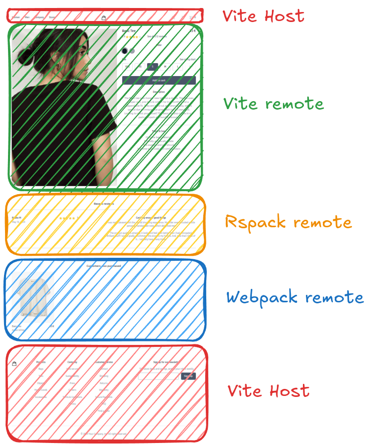

# Vite plugin for Module Federation

[](https://www.npmjs.com/package/@module-federation/vite)

## Reason why 🤔

[Microservices](https://martinfowler.com/articles/microservices.html) nowadays is a well-known concept and maybe you are using it in your current company.
Do you know that now you can apply similar ideas on the Frontend?
With [Module Federation](https://blog.logrocket.com/building-micro-frontends-webpacks-module-federation/#:~:text=Module%20federation%20is%20a%20JavaScript,between%20two%20different%20application%20codebases.) you can load separately compiled and deployed code into a unique application.
This plugin makes Module Federation work together with [Vite](https://vitejs.dev/).

## Working implementations

### [Vue](https://github.com/gioboa/vue-microfrontend-demo)

### [React](https://github.com/gioboa/react-microfrontend-demo)<br>

### [Svelte](https://github.com/gioboa/svelte-microfrontend-demo)<br>

### [SvelteKit](https://github.com/gioboa/sveltekit-microfrontend-demo)<br>

### [SolidJS](https://github.com/gioboa/solid-microfrontend-demo)<br>

### [More examples here](https://github.com/module-federation/vite/tree/main/examples)<br>

## Try this crazy example with all these bundlers together



<p float="left">
  
   
  
</p>

```bash
pnpm install
pnpm run build
pnpm run multi-example
```

## Getting started 🚀

https://module-federation.io/guide/basic/webpack.html

With **@module-federation/vite**, the process becomes delightfully simple, you will only find the differences from a normal Vite configuration.

> This example is with [Vue.js](https://vuejs.org/)</br>
> The @module-federation/vite configuration remains the same for different frameworks.

## The Remote Application configuration

file: **remote/vite.config.ts**

```ts
import { defineConfig } from 'vite';
import { federation } from '@module-federation/vite'; 👈

export default defineConfig({
  [...]
  plugins: [
    [...]
    federation({ 👈
      name: "remote",
      filename: "remoteEntry.js",
      exposes: {
        "./remote-app": "./src/App.vue",
      },
      shared: ["vue"],
    }),
  ],
  server: {
    origin: "http://localhost:{Your port}"
  },
  // Do you need to support build targets lower than chrome89?
  // You can use 'vite-plugin-top-level-await' plugin for that.
  build: {
    target: 'chrome89',
  },
  [...]
});
```

In this remote app configuration, we define a remoteEntry.js file that will expose the App component.
The shared property ensures that both host and remote applications use the same vue library.

## The Host Application configuration

file **host/vite.config.ts**

```ts
import { defineConfig } from 'vite';
import { federation } from '@module-federation/vite'; 👈

export default defineConfig({
  [...]
  plugins: [
    [...]
    federation({ 👈
      name: "host",
      remotes: {
        remote: {
          type: "module",
          name: "remote",
          entry: "https://[...]/remoteEntry.js",
          entryGlobalName: "remote",
          shareScope: "default",
        },
      },
      filename: "remoteEntry.js",
      shared: ["vue"],
    }),
  ],
  server: {
    origin: "http://localhost:{Your port}"
  },
  // Do you need to support build targets lower than chrome89?
  // You can use 'vite-plugin-top-level-await' plugin for that.
  build: {
    target: 'chrome89',
  },
  [...]
});
```

The host app configuration specifies its name, the filename of its exposed remote entry remoteEntry.js, and importantly, the configuration of the remote application to load.

## Load the Remote App

In your host app, you can now import and use the remote app with **defineAsyncComponent**

file **host/src/App.vue**

```ts
<script setup lang="ts">
import { defineAsyncComponent } from "vue";
const RemoteMFE = defineAsyncComponent( 👈
  () => import("remote/remote-app")
);
</script>

<template>
  <RemoteMFE v-if="!!RemoteMFE" /> 👈
</template>
```

### So far so good 🎉

Now you are ready to use Module Federation in Vite!
