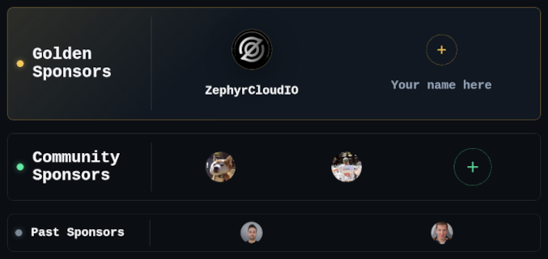

# Vite plugin for Module Federation

[](https://www.npmjs.com/package/@module-federation/vite)

## Vite and VoidZero recommend this plugin

[Read the announcement](https://www.linkedin.com/posts/voidzero_github-module-federationvite-vite-plugin-activity-7449452398202241024-JyAL).

<br />

<a href="https://github.com/sponsors/gioboa">
  
</a>

## Become a sponsor

[Support this project on GitHub Sponsors](https://github.com/sponsors/gioboa)

## Reason why 🤔

[Microservices](https://martinfowler.com/articles/microservices.html) nowadays is a well-known concept and maybe you are using it in your current company.
Do you know that now you can apply similar ideas on the Frontend?
With [Module Federation](https://blog.logrocket.com/building-micro-frontends-webpacks-module-federation/#:~:text=Module%20federation%20is%20a%20JavaScript,between%20two%20different%20application%20codebases.) you can load separately compiled and deployed code into a unique application.
This plugin makes Module Federation work together with [Vite](https://vitejs.dev/).

## Working implementations

Examples live in [`gioboa/module-federation-vite-examples`](https://github.com/gioboa/module-federation-vite-examples):

| Example                                                                                  | Host            | Remote            | Framework                   |
| ---------------------------------------------------------------------------------------- | --------------- | ----------------- | --------------------------- |
| [Alpine](https://github.com/gioboa/module-federation-vite-examples/tree/main/alpine)     | `alpine-host`   | `alpine-remote`   | Alpine.js                   |
| [Angular](https://github.com/gioboa/module-federation-vite-examples/tree/main/angular)   | `angular-host`  | `angular-remote`  | Angular                     |
| [Ember](https://github.com/gioboa/module-federation-vite-examples/tree/main/ember)       | `ember-host`    | `ember-remote`    | Ember 7                     |
| [Lit](https://github.com/gioboa/module-federation-vite-examples/tree/main/lit)           | `lit-host`      | `lit-remote`      | Lit                         |
| [Nuxt](https://github.com/gioboa/module-federation-vite-examples/tree/main/nuxt)         | `nuxt-host`     | `nuxt-remote`     | Nuxt 4                      |
| [Nx](https://github.com/gioboa/react-nx-microfrontend-demo)                              | `host`          | `remote`          | React + Nx                  |
| [Preact](https://github.com/gioboa/module-federation-vite-examples/tree/main/preact)     | `preact-host`   | `preact-remote`   | Preact 10                   |
| [React](https://github.com/gioboa/module-federation-vite-examples/tree/main/react)       | `react-host`    | `react-remote`    | React 19                    |
| [Solid](https://github.com/gioboa/module-federation-vite-examples/tree/main/solid)       | `solid-host`    | `solid-remote`    | Solid                       |
| [Svelte](https://github.com/gioboa/module-federation-vite-examples/tree/main/svelte)     | `svelte-host`   | `svelte-remote`   | Svelte 5                    |
| [TanStack](https://github.com/gioboa/module-federation-vite-examples/tree/main/tanstack) | `tanstack-host` | `tanstack-remote` | TanStack Router + React 19  |
| [Turborepo](https://github.com/gioboa/react-turborepo-microfrontend-demo)                | `host`          | `remote`          | React + Turborepo           |
| [Vinext](https://github.com/gioboa/module-federation-vite-examples/tree/main/vinext)     | `vinext-host`   | `vinext-remote`   | Vinext + Next 16 + React 19 |
| [Vue](https://github.com/gioboa/module-federation-vite-examples/tree/main/vue)           | `vue-host`      | `vue-remote`      | Vue 3                       |

## Try this crazy example with all these bundlers together


<p float="left">
  
   
  
</p>

```bash
pnpm install
pnpm run build
pnpm run multi-example
```

## Getting started 🚀

[https://module-federation.io/integrations/build-tool/vite](https://module-federation.io/integrations/build-tool/vite)

With **@module-federation/vite**, the process becomes delightfully simple, you will only find the differences from a normal Vite configuration.

> This example is with [Vue.js](https://vuejs.org/)</br>
> The @module-federation/vite configuration remains the same for different frameworks.

## Dedicated configuration file

You can keep Module Federation options in `module-federation.config.ts`.

```ts
import { createModuleFederationConfig } from "@module-federation/vite";

export default createModuleFederationConfig({
  name: "remote",
  filename: "remoteEntry.js",
  exposes: {
    "./remote-app": "./src/App.vue",
  },
  shared: ["vue"],
});
```

```ts
import { defineConfig } from "vite";
import { federation } from "@module-federation/vite";
import moduleFederationConfig from "./module-federation.config";

export default defineConfig({
  plugins: [federation(moduleFederationConfig)],
});
```

## The Remote Application configuration

file: **remote/vite.config.ts**

```ts
import { defineConfig } from 'vite';
import { federation } from '@module-federation/vite'; 👈

export default defineConfig({
  [...]
  plugins: [
    [...]
    federation({ 👈
      name: "remote",
      filename: "remoteEntry.js",
      // optional: additional "var" remoteEntry file
      // needed only for legacy hosts with "var" usage (remote.type = 'var')
      varFilename: "varRemoteEntry.js",
      exposes: {
        "./remote-app": "./src/App.vue",
      },
      shared: ["vue"],
    }),
  ],
  server: {
    origin: "http://localhost:{Your port}"
  },
  [...]
});
```

In this remote app configuration, we define a remoteEntry.js file that will expose the App component.
The shared property ensures that both host and remote applications use the same vue library.

## The Host Application configuration

file **host/vite.config.ts**

```ts
import { defineConfig } from 'vite';
import { federation } from '@module-federation/vite'; 👈

export default defineConfig({
  [...]
  plugins: [
    [...]
    federation({ 👈
      name: "host",
      remotes: {
        remote: {
          type: "module", // type "var" (default) for vite remote is supported with remote's `varFilename` option
          name: "remote",
          entry: "https://[...]/remoteEntry.js",
          entryGlobalName: "remote",
          shareScope: "default",
        },
      },
      filename: "remoteEntry.js",
      shared: ["vue"],
      // Optional parameter that controls where the host initialization script is injected.
      // By default, it is injected into the index.html file.
      // You can set this to "entry" to inject it into the entry script instead.
      // Recommended for SSR hosts without index.html (Nitro, TanStack Start) so
      // initHost() completes before hydrateRoot and @module-federation/bridge-react
      // remotes render on first paint.
      hostInitInjectLocation: "html", // or "entry"
      // Controls whether all CSS assets from the bundle should be added to every exposed module.
      // When false (default), the plugin will not process any CSS assets.
      // When true, all CSS assets are bundled into every exposed module.
      bundleAllCSS: false, // or true
      // Timeout for parsing modules in seconds.
      // Defaults to 10 seconds.
      moduleParseTimeout: 10,
      // Idle timeout for parsing modules in seconds. When set, the timeout
      // resets on every parsed module and only fires when there has been no
      // module activity for the configured duration. Prefer this over
      // moduleParseTimeout for large codebases where total build time may
      // exceed the fixed timeout value.
      moduleParseIdleTimeout: 10,
      // Controls whether module federation manifest artifacts are generated.
      // Type: boolean | object
      // - false/undefined: no manifest generated
      // - true: generates mf-manifest.json + mf-stats.json (default names)
      // - object: overrides fileName/filePath and asset analysis behavior
      manifest: {
        // Optional output file name for runtime manifest.
        // Default: "mf-manifest.json"
        fileName: "mf-manifest.json",
        // Optional output directory/path for both artifacts.
        // Example: "dist/" -> dist/mf-manifest.json + dist/mf-stats.json
        filePath: "dist/",
        // If true, skips asset analysis.
        // Effect: shared/exposes are omitted from manifest and assetAnalysis is omitted from stats.
        // It also disables the preload-helper patch used for remotes.
        // In serve for consumer-only apps, this defaults to true unless explicitly set.
        disableAssetsAnalyze: false,
        // Optional hook to mutate generated manifest/stats data.
        additionalData: ({ stats }) => {
          stats.metaData.deployEnv = process.env.NODE_ENV;
          stats.metaData.region = "eu";
          stats.custom = {
            buildId: process.env.BUILD_ID,
          };
        },
        // Or return a replacement/merged object.
        // additionalData: ({ stats }) => ({
        //   ...stats,
        //   custom: { buildId: process.env.BUILD_ID },
        // }),
      },
    }),
  ],
  server: {
    origin: "http://localhost:{Your port}"
  },
  [...]
});
```

The host app configuration specifies its name, the filename of its exposed remote entry remoteEntry.js, and importantly, the configuration of the remote application to load.
You can specify the place the host initialization file is injected with the **hostInitInjectLocation** option, which is described in the example code above.
The **moduleParseTimeout** option allows you to configure the maximum time to wait for module parsing during the build process.
The **moduleParseIdleTimeout** option is an alternative that resets the timer on every parsed module. It only fires when there has been no module activity for the configured duration, making it suitable for large codebases where the total build time exceeds the fixed timeout.

## Load the Remote App

In your host app, you can now import and use the remote app with **defineAsyncComponent**

file **host/src/App.vue**

```ts
<script setup lang="ts">
import { defineAsyncComponent } from "vue";
const RemoteMFE = defineAsyncComponent( 👈
  () => import("remote/remote-app")
);
</script>

<template>
  <RemoteMFE v-if="!!RemoteMFE" /> 👈
</template>
```

## Shared Tree Shaking

Shared Tree Shaking reduces shared dependency bundles to the exports used by the application.

```ts
federation({
  shared: {
    antd: {
      singleton: true,
      treeShaking: {
        mode: "runtime-infer", // or "server-calc"
        usedExports: ["Button", "Input"],
      },
    },
  },
  treeShakingDir: "independent-packages",
});
```

`runtime-infer` is useful for local development and falls back to the full dependency when the required exports are not available. `server-calc` is recommended for deployments because it can use aggregated export metadata from all consumers.

Do not combine `eager: true` with `treeShaking`; eager shared dependencies are bundled into the initial entry and cannot use the on-demand tree-shaking path. Choose eager loading for small dependencies, or tree shaking for larger dependencies such as component libraries.

With `server-calc`, the Vite build records the exports used by each application in its generated Module Federation metadata. A deployment service must then collect that metadata for all applications that share the same dependency and version, merge their `usedExports` lists, and use the resulting union to create one optimized secondary shared artifact. For example, if one application uses `Button` and another uses `Input`, the secondary artifact must contain both exports.

After creating the secondary artifact, the deployment service must publish it to a location accessible by consumers, such as a CDN, and update the remote Snapshot with the artifact's URL, unique name, and available tree-shaking status. Consumers use those Snapshot fields to decide whether the optimized artifact can satisfy their required exports and version.

This deployment step is separate from the local Vite build; the plugin only emits the metadata and runtime support needed by the service. If the Snapshot is not updated, the artifact cannot be fetched, the versions do not match, or the artifact does not provide all required exports, the runtime ignores the optimized artifact and safely loads the complete shared dependency instead.

## ⚠️ `codeSplitting` settings are controlled by the plugin

Do not set either `build.rollupOptions.output.codeSplitting` or
`build.rolldownOptions.output.codeSplitting` to `false` with this plugin — it will be **automatically ignored**.

`codeSplitting.groups` is also ignored because grouping shared-runtime chunks can break MF init order.
Module Federation needs `loadShare` and `runtimeInitStatus` isolated into separate chunks for correct bootstrap behavior.

## ⚠️ `manualChunks` is not supported

Do not use `build.rollupOptions.output.manualChunks` or
`build.rolldownOptions.output.manualChunks` with this plugin — it will be **automatically ignored**.
The plugin manages the runtime chunk graph itself, and forcing custom chunk grouping can break Module Federation bootstrap order.
The plugin injects the splits it needs so `runtimeInitStatus` and `loadShare` stay isolated.

### So far so good 🎉

Now you are ready to use Module Federation in Vite!
