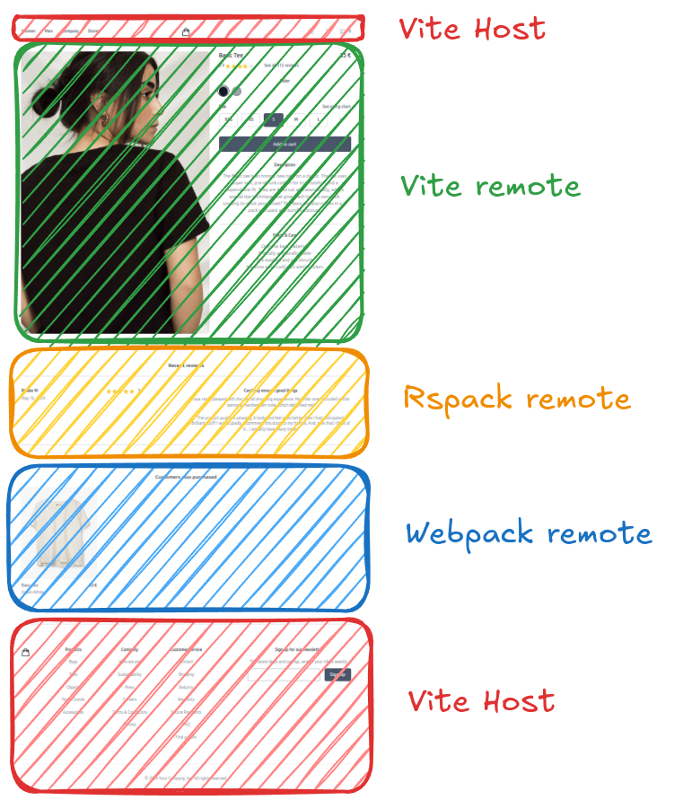

# Vite plugin for Module Federation

[](https://www.npmjs.com/package/@module-federation/vite)

## Reason why 🤔

[Microservices](https://martinfowler.com/articles/microservices.html) nowadays is a well-known concept and maybe you are using it in your current company.
Do you know that now you can apply similar ideas on the Frontend?
With [Module Federation](https://blog.logrocket.com/building-micro-frontends-webpacks-module-federation/#:~:text=Module%20federation%20is%20a%20JavaScript,between%20two%20different%20application%20codebases.) you can load separately compiled and deployed code into a unique application.
This plugin makes Module Federation work together with [Vite](https://vitejs.dev/).

## Working implementations

Examples live in [`gioboa/module-federation-vite-examples`](https://github.com/gioboa/module-federation-vite-examples):

| Example                                                                                  | Host            | Remote            | Framework                   |
| ---------------------------------------------------------------------------------------- | --------------- | ----------------- | --------------------------- |
| [Alpine](https://github.com/gioboa/module-federation-vite-examples/tree/main/alpine)     | `alpine-host`   | `alpine-remote`   | Alpine.js                   |
| [Angular](https://github.com/gioboa/module-federation-vite-examples/tree/main/angular)   | `angular-host`  | `angular-remote`  | Angular                     |
| [Lit](https://github.com/gioboa/module-federation-vite-examples/tree/main/lit)           | `lit-host`      | `lit-remote`      | Lit                         |
| [Nuxt](https://github.com/gioboa/module-federation-vite-examples/tree/main/nuxt)         | `nuxt-host`     | `nuxt-remote`     | Nuxt 4                      |
| [Preact](https://github.com/gioboa/module-federation-vite-examples/tree/main/preact)     | `preact-host`   | `preact-remote`   | Preact 10                   |
| [React](https://github.com/gioboa/module-federation-vite-examples/tree/main/react)       | `react-host`    | `react-remote`    | React 19                    |
| [Solid](https://github.com/gioboa/module-federation-vite-examples/tree/main/solid)       | `solid-host`    | `solid-remote`    | Solid                       |
| [Svelte](https://github.com/gioboa/module-federation-vite-examples/tree/main/svelte)     | `svelte-host`   | `svelte-remote`   | Svelte 5                    |
| [TanStack](https://github.com/gioboa/module-federation-vite-examples/tree/main/tanstack) | `tanstack-host` | `tanstack-remote` | TanStack Router + React 19  |
| [Vinext](https://github.com/gioboa/module-federation-vite-examples/tree/main/vinext)     | `vinext-host`   | `vinext-remote`   | Vinext + Next 16 + React 19 |
| [Vue](https://github.com/gioboa/module-federation-vite-examples/tree/main/vue)           | `vue-host`      | `vue-remote`      | Vue 3                       |

## Try this crazy example with all these bundlers together



<p float="left">
  
   
  
</p>

```bash
pnpm install
pnpm run build
pnpm run multi-example
```

## Getting started 🚀

https://module-federation.io/guide/basic/webpack.html

With **@module-federation/vite**, the process becomes delightfully simple, you will only find the differences from a normal Vite configuration.

> This example is with [Vue.js](https://vuejs.org/)</br>
> The @module-federation/vite configuration remains the same for different frameworks.

## The Remote Application configuration

file: **remote/vite.config.ts**

```ts
import { defineConfig } from 'vite';
import { federation } from '@module-federation/vite'; 👈

export default defineConfig({
  [...]
  plugins: [
    [...]
    federation({ 👈
      name: "remote",
      filename: "remoteEntry.js",
      // optional: additional "var" remoteEntry file
      // needed only for legacy hosts with "var" usage (remote.type = 'var')
      varFilename: "varRemoteEntry.js",
      exposes: {
        "./remote-app": "./src/App.vue",
      },
      shared: ["vue"],
    }),
  ],
  server: {
    origin: "http://localhost:{Your port}"
  },
  // Do you need to support build targets lower than chrome89?
  // You can use 'vite-plugin-top-level-await' plugin for that.
  build: {
    target: 'chrome89',
  },
  [...]
});
```

In this remote app configuration, we define a remoteEntry.js file that will expose the App component.
The shared property ensures that both host and remote applications use the same vue library.

## The Host Application configuration

file **host/vite.config.ts**

```ts
import { defineConfig } from 'vite';
import { federation } from '@module-federation/vite'; 👈

export default defineConfig({
  [...]
  plugins: [
    [...]
    federation({ 👈
      name: "host",
      remotes: {
        remote: {
          type: "module", // type "var" (default) for vite remote is supported with remote's `varFilename` option
          name: "remote",
          entry: "https://[...]/remoteEntry.js",
          entryGlobalName: "remote",
          shareScope: "default",
        },
      },
      filename: "remoteEntry.js",
      shared: ["vue"],
      // Optional parameter that controls where the host initialization script is injected.
      // By default, it is injected into the index.html file.
      // You can set this to "entry" to inject it into the entry script instead.
      // Useful if your application does not load from index.html.
      hostInitInjectLocation: "html", // or "entry"
      // Controls whether all CSS assets from the bundle should be added to every exposed module.
      // When false (default), the plugin will not process any CSS assets.
      // When true, all CSS assets are bundled into every exposed module.
      bundleAllCSS: false, // or true
      // Timeout for parsing modules in seconds.
      // Defaults to 10 seconds.
      moduleParseTimeout: 10,
      // Idle timeout for parsing modules in seconds. When set, the timeout
      // resets on every parsed module and only fires when there has been no
      // module activity for the configured duration. Prefer this over
      // moduleParseTimeout for large codebases where total build time may
      // exceed the fixed timeout value.
      moduleParseIdleTimeout: 10,
      // Controls whether module federation manifest artifacts are generated.
      // Type: boolean | object
      // - false/undefined: no manifest generated
      // - true: generates mf-manifest.json + mf-stats.json (default names)
      // - object: overrides fileName/filePath and asset analysis behavior
      manifest: {
        // Optional output file name for runtime manifest.
        // Default: "mf-manifest.json"
        fileName: "mf-manifest.json",
        // Optional output directory/path for both artifacts.
        // Example: "dist/" -> dist/mf-manifest.json + dist/mf-stats.json
        filePath: "dist/",
        // If true, skips asset analysis.
        // Effect: shared/exposes are omitted from manifest and assetAnalysis is omitted from stats.
        // It also disables the preload-helper patch used for remotes.
        // In serve for consumer-only apps, this defaults to true unless explicitly set.
        disableAssetsAnalyze: false,
      },
    }),
  ],
  server: {
    origin: "http://localhost:{Your port}"
  },
  // Do you need to support build targets lower than chrome89?
  // You can use 'vite-plugin-top-level-await' plugin for that.
  build: {
    target: 'chrome89',
  },
  [...]
});
```

The host app configuration specifies its name, the filename of its exposed remote entry remoteEntry.js, and importantly, the configuration of the remote application to load.
You can specify the place the host initialization file is injected with the **hostInitInjectLocation** option, which is described in the example code above.
The **moduleParseTimeout** option allows you to configure the maximum time to wait for module parsing during the build process.
The **moduleParseIdleTimeout** option is an alternative that resets the timer on every parsed module. It only fires when there has been no module activity for the configured duration, making it suitable for large codebases where the total build time exceeds the fixed timeout.

## Load the Remote App

In your host app, you can now import and use the remote app with **defineAsyncComponent**

file **host/src/App.vue**

```ts
<script setup lang="ts">
import { defineAsyncComponent } from "vue";
const RemoteMFE = defineAsyncComponent( 👈
  () => import("remote/remote-app")
);
</script>

<template>
  <RemoteMFE v-if="!!RemoteMFE" /> 👈
</template>
```

## ⚠️ `codeSplitting` settings are controlled by the plugin

Do not set either `build.rollupOptions.output.codeSplitting` or
`build.rolldownOptions.output.codeSplitting` to `false` with this plugin — it will be **automatically ignored**.

`codeSplitting.groups` is also ignored because grouping shared-runtime chunks can break MF init order.
Module Federation needs `loadShare` and `runtimeInitStatus` isolated into separate chunks for correct bootstrap behavior.

## ⚠️ `manualChunks` is not supported

Do not use `build.rollupOptions.output.manualChunks` or
`build.rolldownOptions.output.manualChunks` with this plugin — it will be **automatically ignored**.
Module federation transforms shared dependency imports with top-level `await`, and grouping these transformed modules into a single chunk creates circular async dependencies that cause the application to silently hang.
The plugin injects its own split so `runtimeInitStatus` and `loadShare` are kept isolated.

### So far so good 🎉

Now you are ready to use Module Federation in Vite!
